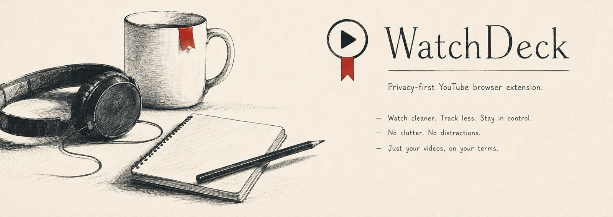

# WatchDeck

**The YouTube companion that respects your time, your attention, and your data.**

Local-only · No account · No sync · No tracking

---

## What it does today

YouTube forgets where you stopped. Across reloads. Across SPA navigations. Across days. WatchDeck quietly remembers your position on every video you watch and seeks back to it the next time you open it.

That is the first feature. More are coming.

## What is coming next

WatchDeck is built for a long backlog of small, useful YouTube enhancements. Each one ships behind the same principles: local-first, narrow scope, no tracking, honest defaults. Planned directions include:

- **Continuity.** A private continue-watching dashboard. Per-channel resume memory. Local export of your saved progress.
- **Bookmarks and notes.** Timestamped bookmarks. Private notes attached to a video. One-click copy of timestamped links.
- **Player memory.** Default playback speed. Preferred quality with a safe fallback. A-B segment loop. Captions that stay on when you want them.
- **Focus.** Hide recommendations, comments, live chat, or Shorts. Focus presets for learning, music, or research.
- **Workflow.** Local queues separate from YouTube playlists. Triage saved videos into states like later, learning, reference, or done.

## Why it is different

- **Local by default.** Resume timestamps live in your browser's local storage. There is no server, no account, no analytics, no telemetry.
- **Narrow surface.** The extension runs only on `youtube.com/watch` pages. Nothing on the homepage, Shorts, live streams, embeds, or anywhere else on the web.
- **Quiet.** No overlays. No toasts. No autoplay hijacking. The only thing you notice is that your video resumes.
- **Honest.** Open the popup. You see exactly what is saved. One click erases it.

## Install

### Chrome Web Store
*Listing coming soon.*

### Download a release ZIP (recommended for users)

1. Go to the [Releases page](https://github.com/senutpal/watchdeck/releases) and download the latest `watchdeck-x.y.z.zip`.
2. Unzip it anywhere on your computer. You will get a folder containing `manifest.json`, `popup.html`, and the script and icon files.
3. Open `chrome://extensions` (works in any Chromium-based browser: Chrome, Brave, Edge, Arc, Vivaldi).
4. Toggle **Developer mode** on in the top right.
5. Click **Load unpacked**. Select the unzipped folder.
6. WatchDeck appears in your toolbar. Click the icon to open the popup.

To update later, download the new release ZIP, unzip over the same folder, then click the reload arrow on the extension card in `chrome://extensions`.

### Build from source (for contributors)

1. Clone this repo. Run `npm install && npm run build`.
2. Open `chrome://extensions`. Enable **Developer mode**.
3. Click **Load unpacked**. Choose the `dist/` folder.

## Privacy

WatchDeck stores per-video resume timestamps **only in your own browser**. Nothing leaves your device.

| Permission | Why |
|------------|-----|
| `storage` | Save resume timestamps in `chrome.storage.local`. |
| `activeTab` | When you click the toolbar icon, identify the current YouTube tab so the popup can target it. Granted only on user gesture. Revoked on tab change. |
| Content script on `https://www.youtube.com/*` | The only place WatchDeck runs. |

WatchDeck never sees what is on any other website. Read the full statement in [PRIVACY.md](PRIVACY.md).

## Develop

```sh
npm install
npm run build      # bundle into dist/
npm test           # run unit tests
npm run release    # build, test, package an upload-ready ZIP
```

| Command | What it does |
|---------|--------------|
| `npm run build` | Bundle the extension into `dist/`. |
| `npm test` | Run the test suite. |
| `npm run smoke` | Verify build artifacts and manifest contracts. |
| `npm run icons` | Regenerate icons from `assets/branding/watchdeck-logo.png`. |
| `npm run release` | Full pipeline: build, smoke, tests, ZIP. |

### Project layout

```
src/
├── entrypoints/      content script · service worker · popup
├── features/resume/  eligibility · controller · progress tracker
├── adapters/youtube/ SPA detection · player lifecycle
├── storage/          chrome.storage.local repositories
└── settings/         user preferences
```

### Releases are fully automated

WatchDeck uses [Conventional Commits](https://www.conventionalcommits.org) plus [release-please](https://github.com/googleapis/release-please) to drive releases end to end. There is no manual version bump.

How it works:

1. Every commit landed on `main` is parsed by the **Release Please** workflow.
2. Once the next release would contain at least one user-visible change (`fix:` or `feat:`), release-please opens a **Release PR** that bumps `package.json` and `public/manifest.json` together and writes a CHANGELOG entry from the commits.
3. Reviewing and merging that PR cuts a tagged GitHub Release.
4. Publishing the release fires the **Release** workflow. It checks out the tag, runs the full pipeline (`build` → `smoke` → `vitest --run` → `package`), and attaches `watchdeck-X.Y.Z.zip` as a release asset.
5. Users go to the [Releases page](https://github.com/senutpal/watchdeck/releases), download the ZIP, unzip, and load unpacked.

Commit prefixes that drive releases:

| Prefix | Bumps |
|--------|-------|
| `fix: …` | patch (`0.1.0` → `0.1.1`) |
| `feat: …` | minor (`0.1.0` → `0.2.0`) |
| `feat!: …` or any commit with a `BREAKING CHANGE:` footer | major (`0.1.0` → `1.0.0`) |
| `chore:`, `docs:`, `ci:`, `test:`, `refactor:`, `style:` | no release |

Anything that ships to users belongs as `feat` or `fix`. Internal cleanup belongs as `chore`. Read [CONTRIBUTING.md](CONTRIBUTING.md) for the full convention.

## Contribute

Bug reports, feature ideas, and pull requests are welcome. See [CONTRIBUTING.md](CONTRIBUTING.md) before opening a PR. Be kind. Read [CODE_OF_CONDUCT.md](CODE_OF_CONDUCT.md).

For security disclosure, see [SECURITY.md](SECURITY.md). For the privacy statement, see [PRIVACY.md](PRIVACY.md). For release history, see [CHANGELOG.md](CHANGELOG.md).

For anything else, reach the maintainer at <contactutpalsen@gmail.com>.

## License

[MIT](LICENSE)
